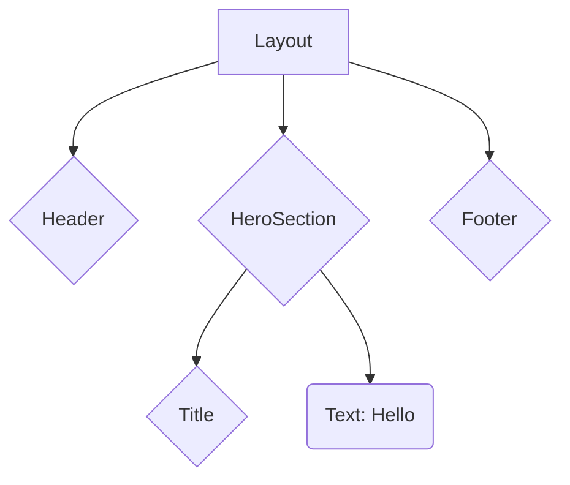

# Virtual DOM

A programming concept where a “virtual” representation of a UI is kept in memory and synced with the “real” DOM by a library such as ReactDOM.

- At that time (2013), updating the real DOM is considered an expensive operation.
- Instead of directly manipulating the real DOM, which can be slow, React compares the old and new VDOMs.
- Based on the differences, React calculates the minimal changes needed in the real DOM.
- This makes UI updates performant and minimizes unnecessary DOM manipulations.

--- 
layout: two-cols-header
layoutClass: gap-4 layout
level: 2
---
# Virtual DOM (cont.)

::left::

This JSX 

```jsx {1-3|5|7-10}
function Button({ text, onClick }) {
  return <button onClick={onClick}>{text}</button>;
}

<Button text="Alert" onClick={() => alert("Hello")} />

_jsx(Button, {
  text: "Alert",
  onClick: () => alert("Hello")
});
```

::right::

<div v-click="3">

will produce this VDOM

```json
{
  "key": null,
  "ref": null,
  "props": {
    "text": "Alert"
  },
  "_owner": null
}
```


</div>

<style>
.layout {
  grid-template-rows: min-content 1fr;
}
</style>

 
---
layout: two-cols
---

# VDOM Tree

The tree depth reflects your component structure.

```jsx
<Layout>
  <Header />
  <HeroSection>
    <Title>Hello</Title>
  </HeroSection>
  <Footer />
</Layout>
```

::right::


