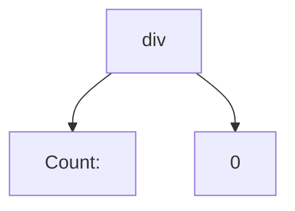
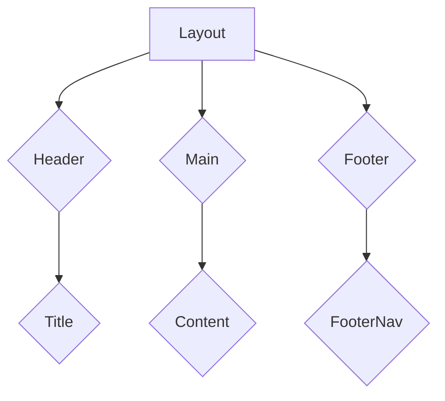
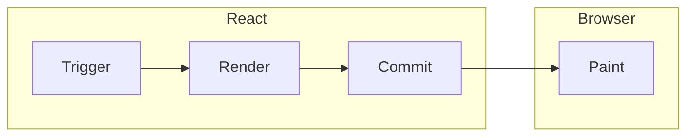
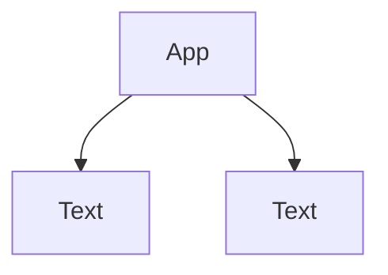

# Declarative 

React uses declarative styles to define a UI. 

<div grid="~ cols-2 gap-4">

<div>

Imperative DOM API
```jsx
const button = document.createElement("button");
button.innerText = "Hello"
button.classList.add("btn btn-primary")
button.addEventListener("click", () => alert("Hello"))
```

</div>

<div>

Declarative React API

```jsx
<div
  className="btn btn-primary"
  onClick={() => alert("Hello")}
>Hello</div>
```

</div>

</div>

---
level: 2
---

# Just Javascript

React empowers you to write UIs with pure JavaScript, no need for additional tools*.

```jsx
import { useState } from "react";
import ReactDOM from "react-dom/client";
import { jsx, jsxs } from "react/jsx-runtime";

function App() {
  const [count, setCount] = useState();

  return jsxs("div", {
    onClick: () => setCount(count + 1),
    children: [
      "Count: ",
      count > 5 ? "Too much" : count.toFixed(2)
    ],
  });
}

ReactDOM
  .createRoot(document.querySelector("#app"))
  .render(jsx(App, {}))
```

---
level: 2
---

# JSX

With compiler, JSX let you express UI directly in code, reducing boilerplate for clean, readable components.

<div grid="~ cols-2 gap-4">

```jsx
function App() {
  const [count, setCount] = useState();

  return jsxs("div", {
    onClick: () => setCount(count + 1),
    children: [
      "Count: ",
      count > 5 ? "Too much" : count.toFixed(2)
    ],
  });
}
```


```jsx
function App() {
  const [count, setCount] = useState();

  return (
    <div onClick={() => setCount(count + 1)}>
      Count: {count > 5 ? "Too much" : count.toFixed(2)}
    </div>
  );
}
```

</div>

--- 
level: 2
---
# React Element

Lightweight descriptions of what to render on the screen, acting as building blocks for your UI.

<div grid="~ cols-2 gap-4">

<div>

```jsx 
<div onClick={() => setCount(count + 1)}>
  Count: {count.toFixed(2)}
</div>
```


</div>

<div text="center">



</div>

</div>

--- 
level: 2
---
# UI Tree

A hierarchical representation of user interface elements, reflecting their parent-child relationships.

<div grid="~ cols-2 gap-4">

<div>

```jsx 
<Layout>
  <Header>
    <Title>UI Tree</Title>
  </Header>
  <Main>
    <Content />
  </Main>
  <Footer>
    <FooterNav />
  </Footer>
</Layout>
```

</div>

<div text="center">



</div>

</div>


---
level: 2
---

# React Rendering

- Trigger: Action that trigger the Render
- Render: React calls your component
- Commit: React diff the changes in VDOM (reconcilation) and optimizely updates the DOM
- Paint: Browser updates UI on the screen

<br />
<br />

<div text="center">



</div>

---
level: 2
---

# Trigger a render
<div />

There are two reasons for a component to render

<div grid="~ cols-2 gap-4">

<div>

1. It’s the component’s initial render.

```jsx
ReactDOM
  .createRoot(document.querySelector("#app"))
  .render(<App />);
```

</div>

<div>

2. The component’s (or one of its ancestors’) state has been updated.

```jsx
function App() {
  const [count, setCount] = useState();

  return (
    <div onClick={() => setCount(count + 1)}>
      <Text value="Count=" />
      <Text value={count} />
    </div>
  );
}
```
</div>

</div>


---
level: 2
---

# Render
<div />

- The render process is recursive, React will render the component and its child until there are no more nested components in the tree
- React will always *re-render* your component unless you explicitly wrap the component with `memo`

<br />

<div grid="~ cols-2 gap-4">

<div>

```jsx
function App() {
  const [count, setCount] = useState();

  return (
    <div onClick={() => setCount(count + 1)}>
      <Text value="Count=" />
      <Text value={count} />
    </div>
  );
}
```

</div>

<div text="center">



UI Tree

</div>

</div>

---
level: 2
---

# Commit
<div />

- React will apply the minimal necessary operations (calculated while rendering) to make the DOM match the latest rendering output.

<br />

<div grid="~ cols-2 gap-4">

<div text="center">


</div>

<div text="center">


<Arrow x1="770" y1="350" x2="770" y2="320" />

Only this node get update in real DOM
</div>


</div>


---
level: 2
---

# Painting
<div />

- Browser paint the changes to the screen. User see the updated UI.


